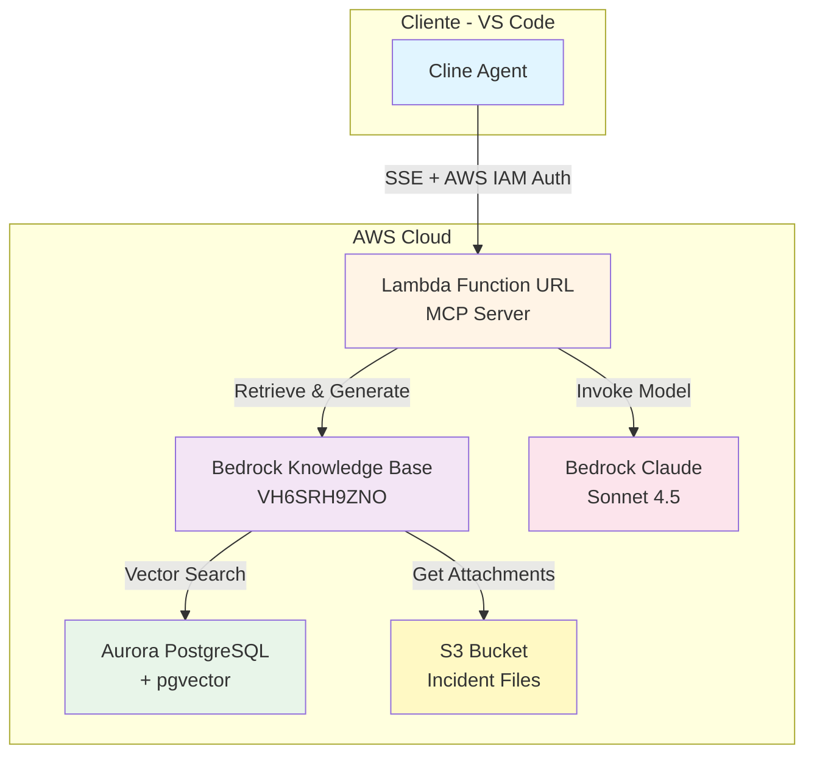
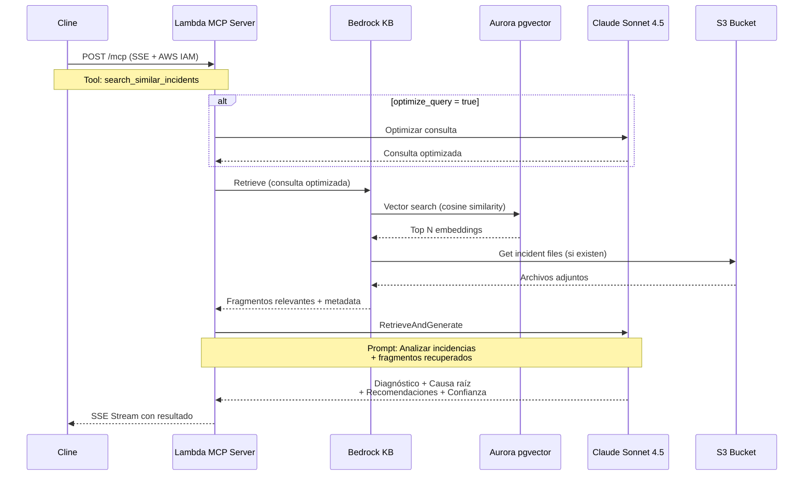

# Arquitectura MCP Remoto - Servidor de Análisis de Incidencias

## 🎯 Objetivo

Crear un servidor MCP (Model Context Protocol) remoto desplegado en AWS Lambda que permita a Cline buscar y analizar incidencias similares desde la base de conocimiento existente.

## 📋 Especificaciones Técnicas

### Configuración Elegida

- **Compute**: AWS Lambda con Function URL
- **Protocolo**: SSE (Server-Sent Events) estándar MCP
- **Autenticación**: AWS IAM Signature V4
- **Base de Conocimiento**: Bedrock Knowledge Base API
- **Modelo LLM**: Claude Sonnet 4.5 (eu-west-1)
- **Embeddings**: Amazon Titan v2 (1024 dimensiones)

## 🏗️ Arquitectura del Sistema



## 🔧 Componentes Principales

### 1. Lambda Function - MCP Server

**Especificaciones**:
```yaml
Runtime: Node.js 20.x
Memory: 1024 MB
Timeout: 300 seconds (5 minutos)
Architecture: arm64 (Graviton2)
Handler: index.handler

Environment Variables:
  BEDROCK_KNOWLEDGE_BASE_ID: VH6SRH9ZNO
  BEDROCK_MODEL_ID: eu.anthropic.claude-sonnet-4-5-20250929-v1:0
  BEDROCK_REGION: eu-west-1
  LOG_LEVEL: INFO

Function URL:
  AuthType: AWS_IAM
  InvokeMode: RESPONSE_STREAM
  Cors:
    AllowOrigins: ["*"]
    AllowMethods: ["POST", "OPTIONS"]
    AllowHeaders: ["*"]
```

**Permisos IAM Requeridos**:
```json
{
  "Version": "2012-10-17",
  "Statement": [
    {
      "Effect": "Allow",
      "Action": [
        "bedrock:Retrieve",
        "bedrock:RetrieveAndGenerate"
      ],
      "Resource": "arn:aws:bedrock:eu-west-1:*:knowledge-base/VH6SRH9ZNO"
    },
    {
      "Effect": "Allow",
      "Action": [
        "bedrock:InvokeModel",
        "bedrock:InvokeModelWithResponseStream"
      ],
      "Resource": "arn:aws:bedrock:eu-west-1::foundation-model/eu.anthropic.claude-sonnet-4-5-20250929-v1:0"
    },
    {
      "Effect": "Allow",
      "Action": [
        "s3:GetObject"
      ],
      "Resource": "arn:aws:s3:::piloto-plan-pruebas-origen-datos-source/*"
    },
    {
      "Effect": "Allow",
      "Action": [
        "logs:CreateLogGroup",
        "logs:CreateLogStream",
        "logs:PutLogEvents"
      ],
      "Resource": "arn:aws:logs:eu-west-1:*:*"
    }
  ]
}
```

### 2. Herramienta MCP: search_similar_incidents

**Definición**:
```typescript
{
  name: "search_similar_incidents",
  description: "Busca incidencias similares en la base de conocimiento y proporciona diagnóstico, causa raíz y recomendaciones basadas en casos históricos",
  inputSchema: {
    type: "object",
    properties: {
      incident_description: {
        type: "string",
        description: "Descripción detallada de la incidencia a analizar"
      },
      optimize_query: {
        type: "boolean",
        description: "Si true, optimiza la consulta con IA antes de buscar (recomendado)",
        default: true
      },
      max_results: {
        type: "number",
        description: "Número máximo de incidencias similares a retornar",
        default: 5,
        minimum: 1,
        maximum: 10
      }
    },
    required: ["incident_description"]
  }
}
```

**Respuesta**:
```typescript
{
  diagnosis: string;              // Diagnóstico del problema
  root_cause: string;             // Causa raíz identificada
  recommended_actions: string[];  // Lista de acciones recomendadas
  confidence_score: number;       // 0.0 - 1.0
  similar_incidents: Array<{
    incident_id: string;
    title: string;
    description: string;
    similarity_score: number;     // 0.0 - 1.0
    resolution: string;
    resolution_time_minutes: number;
  }>;
  original_query?: string;        // Si se optimizó
  optimized_query?: string;       // Consulta optimizada
  metadata: {
    processing_time_ms: number;
    kb_query_time_ms: number;
    llm_analysis_time_ms: number;
    total_tokens: number;
  };
}
```

## 🔄 Flujo de Procesamiento



## 📝 Implementación del Servidor MCP

### Estructura del Proyecto

```
mcp-incidents-lambda/
├── package.json
├── tsconfig.json
├── src/
│   ├── index.ts                    # Handler principal Lambda
│   ├── mcp-server.ts               # Servidor MCP SSE
│   ├── tools/
│   │   └── search-similar-incidents.ts
│   ├── services/
│   │   ├── bedrock-kb-service.ts   # Cliente Bedrock KB
│   │   ├── bedrock-llm-service.ts  # Cliente Claude
│   │   └── query-optimizer.ts      # Optimización de consultas
│   ├── types/
│   │   ├── mcp.ts                  # Tipos MCP
│   │   └── incidents.ts            # Tipos de incidencias
│   └── utils/
│       ├── logger.ts
│       └── metrics.ts
├── infrastructure/
│   ├── template.yaml               # SAM template
│   └── deploy.sh
└── README.md
```

### Handler Principal (index.ts)

```typescript
import { Handler, APIGatewayProxyEventV2 } from 'aws-lambda';
import { MCPServer } from './mcp-server';
import { SearchSimilarIncidentsTool } from './tools/search-similar-incidents';

const mcpServer = new MCPServer({
  name: 'incidents-analyzer',
  version: '1.0.0',
  tools: [
    new SearchSimilarIncidentsTool()
  ]
});

export const handler: Handler = async (event: APIGatewayProxyEventV2) => {
  // Validar autenticación AWS IAM
  if (!event.requestContext.authorizer?.iam) {
    return {
      statusCode: 403,
      body: JSON.stringify({ error: 'Unauthorized' })
    };
  }

  // Extraer información del usuario IAM
  const userArn = event.requestContext.authorizer.iam.userArn;
  const userId = event.requestContext.authorizer.iam.userId;

  console.log(`Request from IAM user: ${userArn}`);

  // Procesar solicitud MCP
  try {
    const body = JSON.parse(event.body || '{}');
    const response = await mcpServer.handleRequest(body, {
      userArn,
      userId
    });

    return {
      statusCode: 200,
      headers: {
        'Content-Type': 'text/event-stream',
        'Cache-Control': 'no-cache',
        'Connection': 'keep-alive'
      },
      body: response
    };
  } catch (error) {
    console.error('Error processing MCP request:', error);
    return {
      statusCode: 500,
      body: JSON.stringify({ error: error.message })
    };
  }
};
```

### Servidor MCP (mcp-server.ts)

```typescript
import { MCPTool, MCPRequest, MCPResponse } from './types/mcp';

export class MCPServer {
  private tools: Map<string, MCPTool>;

  constructor(config: {
    name: string;
    version: string;
    tools: MCPTool[];
  }) {
    this.tools = new Map(
      config.tools.map(tool => [tool.name, tool])
    );
  }

  async handleRequest(
    request: MCPRequest,
    context: { userArn: string; userId: string }
  ): Promise<string> {
    const { method, params } = request;

    switch (method) {
      case 'tools/list':
        return this.listTools();
      
      case 'tools/call':
        return this.callTool(params, context);
      
      default:
        throw new Error(`Unknown method: ${method}`);
    }
  }

  private listTools(): string {
    const toolsList = Array.from(this.tools.values()).map(tool => ({
      name: tool.name,
      description: tool.description,
      inputSchema: tool.inputSchema
    }));

    return this.formatSSEResponse({
      tools: toolsList
    });
  }

  private async callTool(
    params: any,
    context: { userArn: string; userId: string }
  ): Promise<string> {
    const { name, arguments: args } = params;
    
    const tool = this.tools.get(name);
    if (!tool) {
      throw new Error(`Tool not found: ${name}`);
    }

    const result = await tool.execute(args, context);
    
    return this.formatSSEResponse({
      content: [
        {
          type: 'text',
          text: JSON.stringify(result, null, 2)
        }
      ]
    });
  }

  private formatSSEResponse(data: any): string {
    return `data: ${JSON.stringify(data)}\n\n`;
  }
}
```

### Herramienta de Búsqueda (search-similar-incidents.ts)

```typescript
import { MCPTool } from '../types/mcp';
import { BedrockKBService } from '../services/bedrock-kb-service';
import { BedrockLLMService } from '../services/bedrock-llm-service';
import { QueryOptimizer } from '../services/query-optimizer';

export class SearchSimilarIncidentsTool implements MCPTool {
  name = 'search_similar_incidents';
  description = 'Busca incidencias similares en la base de conocimiento y proporciona diagnóstico, causa raíz y recomendaciones';
  
  inputSchema = {
    type: 'object',
    properties: {
      incident_description: {
        type: 'string',
        description: 'Descripción detallada de la incidencia'
      },
      optimize_query: {
        type: 'boolean',
        description: 'Optimizar consulta con IA',
        default: true
      },
      max_results: {
        type: 'number',
        description: 'Número máximo de resultados',
        default: 5,
        minimum: 1,
        maximum: 10
      }
    },
    required: ['incident_description']
  };

  private kbService: BedrockKBService;
  private llmService: BedrockLLMService;
  private queryOptimizer: QueryOptimizer;

  constructor() {
    this.kbService = new BedrockKBService({
      knowledgeBaseId: process.env.BEDROCK_KNOWLEDGE_BASE_ID!,
      region: process.env.BEDROCK_REGION!
    });
    
    this.llmService = new BedrockLLMService({
      modelId: process.env.BEDROCK_MODEL_ID!,
      region: process.env.BEDROCK_REGION!
    });
    
    this.queryOptimizer = new QueryOptimizer(this.llmService);
  }

  async execute(
    args: {
      incident_description: string;
      optimize_query?: boolean;
      max_results?: number;
    },
    context: { userArn: string; userId: string }
  ) {
    const startTime = Date.now();
    
    console.log(`[${context.userId}] Searching for similar incidents`);
    
    let query = args.incident_description;
    let originalQuery: string | undefined;
    
    // Paso 1: Optimizar consulta si está habilitado
    if (args.optimize_query !== false) {
      const optimizeStart = Date.now();
      const optimized = await this.queryOptimizer.optimize(query);
      originalQuery = query;
      query = optimized;
      console.log(`Query optimization took ${Date.now() - optimizeStart}ms`);
    }
    
    // Paso 2: Buscar en Knowledge Base
    const kbStart = Date.now();
    const kbResults = await this.kbService.retrieve({
      query,
      maxResults: args.max_results || 5
    });
    const kbTime = Date.now() - kbStart;
    console.log(`KB retrieval took ${kbTime}ms`);
    
    // Paso 3: Analizar con LLM
    const llmStart = Date.now();
    const analysis = await this.llmService.analyzeIncident({
      query,
      retrievedDocuments: kbResults.results
    });
    const llmTime = Date.now() - llmStart;
    console.log(`LLM analysis took ${llmTime}ms`);
    
    // Paso 4: Formatear respuesta
    const response = {
      diagnosis: analysis.diagnosis,
      root_cause: analysis.rootCause,
      recommended_actions: analysis.recommendedActions,
      confidence_score: analysis.confidenceScore,
      similar_incidents: kbResults.results.map(result => ({
        incident_id: result.metadata.incident_id,
        title: result.metadata.title,
        description: result.content,
        similarity_score: result.score,
        resolution: result.metadata.resolution,
        resolution_time_minutes: result.metadata.resolution_time_minutes
      })),
      ...(originalQuery && {
        original_query: originalQuery,
        optimized_query: query
      }),
      metadata: {
        processing_time_ms: Date.now() - startTime,
        kb_query_time_ms: kbTime,
        llm_analysis_time_ms: llmTime,
        total_tokens: analysis.usage.totalTokens
      }
    };
    
    return response;
  }
}
```

### Servicio Bedrock KB (bedrock-kb-service.ts)

```typescript
import {
  BedrockAgentRuntimeClient,
  RetrieveCommand,
  RetrieveCommandInput
} from '@aws-sdk/client-bedrock-agent-runtime';

export class BedrockKBService {
  private client: BedrockAgentRuntimeClient;
  private knowledgeBaseId: string;

  constructor(config: { knowledgeBaseId: string; region: string }) {
    this.client = new BedrockAgentRuntimeClient({
      region: config.region
    });
    this.knowledgeBaseId = config.knowledgeBaseId;
  }

  async retrieve(params: {
    query: string;
    maxResults: number;
  }) {
    const input: RetrieveCommandInput = {
      knowledgeBaseId: this.knowledgeBaseId,
      retrievalQuery: {
        text: params.query
      },
      retrievalConfiguration: {
        vectorSearchConfiguration: {
          numberOfResults: params.maxResults,
          overrideSearchType: 'HYBRID' // Búsqueda híbrida: vectorial + keywords
        }
      }
    };

    const command = new RetrieveCommand(input);
    const response = await this.client.send(command);

    return {
      results: response.retrievalResults?.map(result => ({
        content: result.content?.text || '',
        score: result.score || 0,
        metadata: result.metadata || {},
        location: result.location
      })) || []
    };
  }
}
```

### Servicio Bedrock LLM (bedrock-llm-service.ts)

```typescript
import {
  BedrockRuntimeClient,
  InvokeModelCommand
} from '@aws-sdk/client-bedrock-runtime';

export class BedrockLLMService {
  private client: BedrockRuntimeClient;
  private modelId: string;

  constructor(config: { modelId: string; region: string }) {
    this.client = new BedrockRuntimeClient({
      region: config.region
    });
    this.modelId = config.modelId;
  }

  async analyzeIncident(params: {
    query: string;
    retrievedDocuments: any[];
  }) {
    const prompt = this.buildAnalysisPrompt(params.query, params.retrievedDocuments);

    const input = {
      modelId: this.modelId,
      contentType: 'application/json',
      accept: 'application/json',
      body: JSON.stringify({
        anthropic_version: 'bedrock-2023-05-31',
        max_tokens: 4096,
        temperature: 0.7,
        messages: [
          {
            role: 'user',
            content: prompt
          }
        ]
      })
    };

    const command = new InvokeModelCommand(input);
    const response = await this.client.send(command);
    
    const responseBody = JSON.parse(
      new TextDecoder().decode(response.body)
    );

    return this.parseAnalysisResponse(responseBody);
  }

  private buildAnalysisPrompt(query: string, documents: any[]): string {
    const documentsText = documents
      .map((doc, i) => `
### Incidencia Similar ${i + 1} (Similitud: ${(doc.score * 100).toFixed(1)}%)
**ID**: ${doc.metadata.incident_id}
**Título**: ${doc.metadata.title}
**Descripción**: ${doc.content}
**Causa Raíz**: ${doc.metadata.root_cause}
**Resolución**: ${doc.metadata.resolution}
**Tiempo de Resolución**: ${doc.metadata.resolution_time_minutes} minutos
      `)
      .join('\n');

    return `Eres un experto en análisis de incidencias técnicas. Analiza la siguiente incidencia y proporciona un diagnóstico detallado basándote en casos históricos similares.

# INCIDENCIA A ANALIZAR
${query}

# INCIDENCIAS SIMILARES DEL HISTÓRICO
${documentsText}

# INSTRUCCIONES
Basándote en las incidencias similares encontradas, proporciona:

1. **DIAGNÓSTICO**: Un análisis claro del problema
2. **CAUSA RAÍZ**: La causa raíz más probable basada en casos similares
3. **ACCIONES RECOMENDADAS**: Lista de pasos específicos para resolver el problema
4. **CONFIANZA**: Tu nivel de confianza en este análisis (0.0 a 1.0)

Responde en formato JSON:
{
  "diagnosis": "...",
  "root_cause": "...",
  "recommended_actions": ["paso 1", "paso 2", ...],
  "confidence_score": 0.85,
  "reasoning": "Breve explicación de por qué tienes este nivel de confianza"
}`;
  }

  private parseAnalysisResponse(response: any) {
    const text = response.content[0].text;
    
    // Extraer JSON del texto
    const jsonMatch = text.match(/\{[\s\S]*\}/);
    if (!jsonMatch) {
      throw new Error('No se pudo parsear la respuesta del LLM');
    }

    const analysis = JSON.parse(jsonMatch[0]);

    return {
      diagnosis: analysis.diagnosis,
      rootCause: analysis.root_cause,
      recommendedActions: analysis.recommended_actions,
      confidenceScore: analysis.confidence_score,
      reasoning: analysis.reasoning,
      usage: {
        inputTokens: response.usage.input_tokens,
        outputTokens: response.usage.output_tokens,
        totalTokens: response.usage.input_tokens + response.usage.output_tokens
      }
    };
  }
}
```

## 🚀 Despliegue

### SAM Template (template.yaml)

```yaml
AWSTemplateFormatVersion: '2010-09-09'
Transform: AWS::Serverless-2016-10-31
Description: MCP Remote Server for Incident Analysis

Globals:
  Function:
    Timeout: 300
    MemorySize: 1024
    Runtime: nodejs20.x
    Architecture: arm64
    Environment:
      Variables:
        BEDROCK_KNOWLEDGE_BASE_ID: VH6SRH9ZNO
        BEDROCK_MODEL_ID: eu.anthropic.claude-sonnet-4-5-20250929-v1:0
        BEDROCK_REGION: eu-west-1
        LOG_LEVEL: INFO

Resources:
  MCPServerFunction:
    Type: AWS::Serverless::Function
    Properties:
      FunctionName: mcp-incidents-server
      CodeUri: ./dist
      Handler: index.handler
      Policies:
        - Statement:
            - Effect: Allow
              Action:
                - bedrock:Retrieve
                - bedrock:RetrieveAndGenerate
              Resource: !Sub 'arn:aws:bedrock:${AWS::Region}:${AWS::AccountId}:knowledge-base/VH6SRH9ZNO'
            - Effect: Allow
              Action:
                - bedrock:InvokeModel
                - bedrock:InvokeModelWithResponseStream
              Resource: !Sub 'arn:aws:bedrock:${AWS::Region}::foundation-model/eu.anthropic.claude-sonnet-4-5-20250929-v1:0'
            - Effect: Allow
              Action:
                - s3:GetObject
              Resource: 'arn:aws:s3:::piloto-plan-pruebas-origen-datos-source/*'
      FunctionUrlConfig:
        AuthType: AWS_IAM
        InvokeMode: RESPONSE_STREAM
        Cors:
          AllowOrigins:
            - '*'
          AllowMethods:
            - POST
            - OPTIONS
          AllowHeaders:
            - '*'

Outputs:
  MCPServerUrl:
    Description: URL del servidor MCP
    Value: !GetAtt MCPServerFunctionUrl.FunctionUrl
  
  MCPServerArn:
    Description: ARN de la función Lambda
    Value: !GetAtt MCPServerFunction.Arn
```

### Script de Despliegue (deploy.sh)

```bash
#!/bin/bash

set -e

echo "🚀 Desplegando MCP Server..."

# Build
echo "📦 Building TypeScript..."
npm run build

# Deploy con SAM
echo "☁️  Deploying to AWS..."
sam deploy \
  --template-file infrastructure/template.yaml \
  --stack-name mcp-incidents-server \
  --capabilities CAPABILITY_IAM \
  --region eu-west-1 \
  --no-confirm-changeset

# Obtener URL
FUNCTION_URL=$(aws cloudformation describe-stacks \
  --stack-name mcp-incidents-server \
  --region eu-west-1 \
  --query 'Stacks[0].Outputs[?OutputKey==`MCPServerUrl`].OutputValue' \
  --output text)

echo "✅ Despliegue completado!"
echo "📍 MCP Server URL: $FUNCTION_URL"
echo ""
echo "🔧 Configuración para Cline:"
echo "{
  \"mcpServers\": {
    \"incidents-analyzer\": {
      \"url\": \"$FUNCTION_URL\",
      \"transport\": \"sse\",
      \"auth\": {
        \"type\": \"aws-iam\",
        \"region\": \"eu-west-1\"
      }
    }
  }
}"
```

## 🔐 Configuración de Autenticación AWS IAM

### Política IAM para Usuarios de Cline

```json
{
  "Version": "2012-10-17",
  "Statement": [
    {
      "Effect": "Allow",
      "Action": "lambda:InvokeFunctionUrl",
      "Resource": "arn:aws:lambda:eu-west-1:ACCOUNT_ID:function:mcp-incidents-server"
    }
  ]
}
```

### Grupo IAM

```bash
# Crear grupo
aws iam create-group --group-name MCPIncidentsUsers

# Adjuntar política
aws iam put-group-policy \
  --group-name MCPIncidentsUsers \
  --policy-name MCPIncidentsAccess \
  --policy-document file://mcp-access-policy.json

# Añadir usuarios al grupo
aws iam add-user-to-group \
  --group-name MCPIncidentsUsers \
  --user-name developer1
```

## 📱 Configuración en Cline

### Archivo de Configuración MCP

Ubicación: `~/.config/Code/User/globalStorage/saoudrizwan.claude-dev/settings/cline_mcp_settings.json`

```json
{
  "mcpServers": {
    "incidents-analyzer": {
      "url": "https://xxxxx.lambda-url.eu-west-1.on.aws/",
      "transport": "sse",
      "auth": {
        "type": "aws-iam",
        "region": "eu-west-1",
        "credentials": {
          "profile": "default"
        }
      }
    }
  }
}
```

## 🧪 Testing

### Test Local con SAM

```bash
# Iniciar API local
sam local start-api

# Test con curl
curl -X POST http://localhost:3000/mcp \
  -H "Content-Type: application/json" \
  -d '{
    "method": "tools/call",
    "params": {
      "name": "search_similar_incidents",
      "arguments": {
        "incident_description": "El servidor web no responde en el puerto 443",
        "optimize_query": true,
        "max_results": 5
      }
    }
  }'
```

### Test desde Cline

```
Usuario: "Busca incidencias similares a: El servidor de base de datos no responde"

Cline ejecutará internamente:
1. Conectar al servidor MCP remoto con AWS IAM auth
2. Llamar a search_similar_incidents
3. Recibir análisis completo
4. Presentar resultados al usuario
```

## 📊 Monitoreo y Logs

### CloudWatch Logs

```bash
# Ver logs en tiempo real
aws logs tail /aws/lambda/mcp-incidents-server --follow

# Buscar errores
aws logs filter-log-events \
  --log-group-name /aws/lambda/mcp-incidents-server \
  --filter-pattern "ERROR"
```

### Métricas CloudWatch

- **Invocations**: Número de llamadas al servidor MCP
- **Duration**: Tiempo de ejecución
- **Errors**: Errores durante la ejecución
- **Throttles**: Invocaciones limitadas

### Alarmas Recomendadas

```yaml
ErrorRateAlarm:
  Type: AWS::CloudWatch::Alarm
  Properties:
    AlarmName: mcp-server-high-error-rate
    MetricName: Errors
    Namespace: AWS/Lambda
    Statistic: Sum
    Period: 300
    EvaluationPeriods: 1
    Threshold: 5
    ComparisonOperator: GreaterThanThreshold
```

## 💰 Estimación de Costos

### Escenario: 1,000 consultas/mes

| Componente | Cálculo | Costo Mensual |
|------------|---------|---------------|
| **Lambda Invocations** | 1,000 requests | $0.00 (free tier) |
| **Lambda Duration** | 1,000 × 10s × 1GB | $0.17 |
| **Lambda Function URL** | 1,000 requests | $0.00 |
| **Bedrock KB Retrieve** | 1,000 queries | $1.00 |
| **Bedrock Claude 4.5** | ~2.5M tokens | $7.50 |
| **CloudWatch Logs** | 1 GB | $0.50 |
| **TOTAL** | | **~$9.17/mes** |

**Extremadamente económico para POC y producción ligera**

## 🎯 Próximos Pasos

1. ✅ Arquitectura definida
2. ⏭️ Implementar código TypeScript
3. ⏭️ Crear SAM template
4. ⏭️ Desplegar a AWS
5. ⏭️ Configurar IAM policies
6. ⏭️ Configurar Cline
