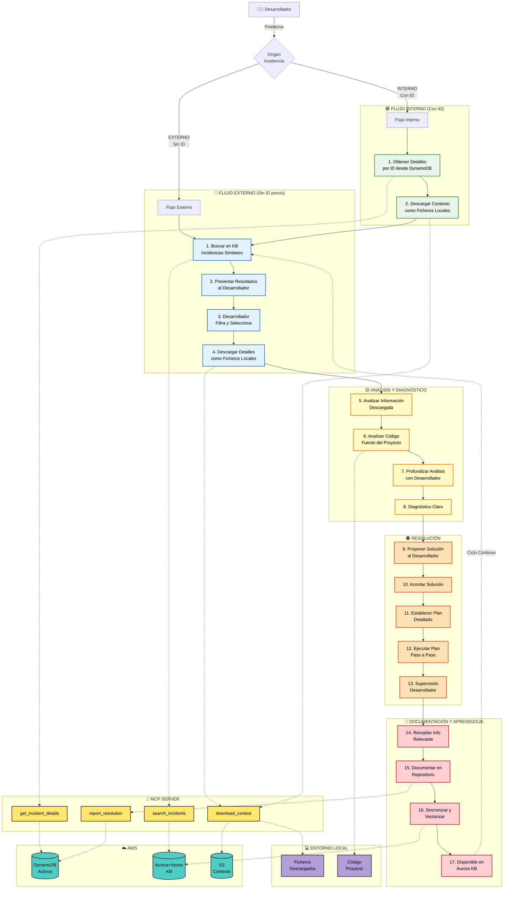
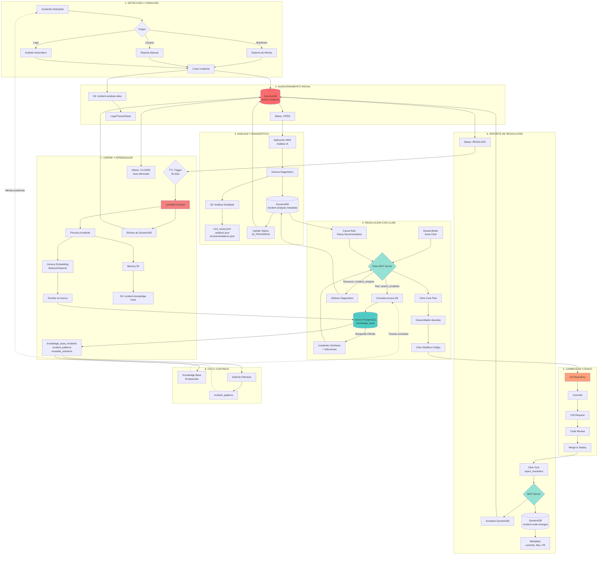

# INTEGRACIÓN CLINE - SISTEMA DE ANÁLISIS DE INCIDENCIAS AWS

## ÍNDICE
1. [VISIÓN GENERAL](#visión-general)
2. [ARQUITECTURA DE INTEGRACIÓN](#arquitectura-de-integración)
3. [CASOS DE USO](#casos-de-uso)
4. [REPOSITORIOS DE DATOS](#repositorios-de-datos)
5. [FLUJO COMPLETO DE INCIDENCIAS](#flujo-completo-de-incidencias)
6. [MCP SERVER](#mcp-server)
7. [ESQUEMA DE BASE DE DATOS AURORA](#esquema-de-base-de-datos-aurora)
8. [IMPLEMENTACIÓN](#implementación)
9. [PRÓXIMOS PASOS](#próximos-pasos)

---

## DIAGRAMA ESQUEMÁTICO DE MÓDULOS



### LEYENDA DEL DIAGRAMA

**Flujos Principales:**
- **🔵 FLUJO EXTERNO**: Incidencia sin ID previo (origen externo)
- **🟢 FLUJO INTERNO**: Incidencia con ID (ya analizada en DynamoDB)
- **🟡 ANÁLISIS**: Análisis conjunto de información y código
- **🟠 RESOLUCIÓN**: Propuesta, acuerdo y ejecución supervisada
- **🔴 DOCUMENTACIÓN**: Captura de conocimiento y sincronización

**Componentes:**
- **🔌 MCP SERVER**: Puente de integración con herramientas
- **☁️ AWS**: Repositorios de datos (DynamoDB, Aurora, S3)
- **💻 ENTORNO LOCAL**: Ficheros descargados y código del proyecto

**Interacción Clave:**
- El desarrollador supervisa y toma decisiones en cada fase
- Los ficheros se descargan localmente para análisis profundo
- El ciclo se cierra enriqueciendo la Knowledge Base

### MÓDULOS Y SUS PROPÓSITOS

```
┌──────────────────────────────────────────────────────────────┐
│ 1. CLINE (Agente IA en IDE)                                  │
├──────────────────────────────────────────────────────────────┤
│ • Recibe problema del desarrollador                          │
│ • Consulta incidencias similares                             │
│ • Crea plan de resolución                                    │
│ • Modifica código                                            │
│ • Reporta solución aplicada                                  │
└──────────────────────────────────────────────────────────────┘
                            ▼
┌──────────────────────────────────────────────────────────────┐
│ 2. MCP SERVER (Puente de Integración)                        │
├──────────────────────────────────────────────────────────────┤
│ • search_incidents: Busca casos similares                    │
│ • get_incident_details: Obtiene diagnósticos                 │
│ • report_resolution: Registra soluciones                     │
│ • find_patterns: Detecta patrones recurrentes                │
└──────────────────────────────────────────────────────────────┘
                            ▼
┌──────────────────────────────────────────────────────────────┐
│ 3. REPOSITORIOS AWS (Almacenamiento y Procesamiento)         │
├──────────────────────────────────────────────────────────────┤
│                                                              │
│  ┌─────────────────┐  ┌──────────────────┐  ┌────────────┐ │
│  │   DynamoDB      │  │  Aurora + Vector │  │     S3     │ │
│  ├─────────────────┤  ├──────────────────┤  ├────────────┤ │
│  │ Incidentes      │  │ Knowledge Base   │  │ Logs       │ │
│  │ Activos         │  │ Búsqueda Híbrida │  │ Análisis   │ │
│  │ (Transaccional) │  │ (Histórico)      │  │ (Archivo)  │ │
│  └─────────────────┘  └──────────────────┘  └────────────┘ │
│                                                              │
│  ┌─────────────────┐  ┌──────────────────┐                 │
│  │   Lambda        │  │   API Gateway    │                 │
│  ├─────────────────┤  ├──────────────────┤                 │
│  │ Procesa         │  │ Expone           │                 │
│  │ Embeddings      │  │ Endpoints        │                 │
│  │ Sincroniza      │  │ Autentica        │                 │
│  └─────────────────┘  └──────────────────┘                 │
└──────────────────────────────────────────────────────────────┘
                            ▼
┌──────────────────────────────────────────────────────────────┐
│ 4. GIT REPOSITORY (Control de Versiones)                     │
├──────────────────────────────────────────────────────────────┤
│ • Commits vinculados a incidentes                            │
│ • Trazabilidad de cambios                                    │
│ • Pull Requests con contexto                                 │
└──────────────────────────────────────────────────────────────┘
```

### FLUJO DE INFORMACIÓN

```
CONSULTA (Cline → AWS):
  Desarrollador pregunta → Cline → MCP → Aurora KB → Incidentes similares

RESOLUCIÓN (Cline → Git):
  Cline modifica código → Git commits → Deploy

APRENDIZAJE (Cline → AWS):
  Solución aplicada → MCP → DynamoDB → Lambda → Aurora KB (enriquecida)

CICLO CONTINUO:
  Aurora KB enriquecida → Mejores respuestas futuras → Resolución más rápida
```

---

## VISIÓN GENERAL

Este proyecto integra **Cline** (agente IA integrado en Visual Studio Code) con una **aplicación de análisis de incidencias en AWS**, creando un ciclo completo de gestión de incidencias que aprovecha el aprendizaje continuo y la automatización inteligente.

### Objetivos

- **Acceso a Knowledge Base**: Cline puede consultar incidencias históricas similares para obtener insights
- **Retroalimentación automática**: Las resoluciones de Cline alimentan la base de conocimiento
- **Planificación informada**: Cline recibe diagnósticos detallados para crear planes de resolución más efectivos

---

## Arquitectura de Integración

### Componentes Principales

```
┌─────────────────────────────────────────────────────────────┐
│                         Cline (IDE)                          │
│  ┌────────────────────────────────────────────────────────┐ │
│  │  Desarrollador solicita ayuda con incidencia           │ │
│  └────────────────────────────────────────────────────────┘ │
└───────────────────────────┬─────────────────────────────────┘
                            │ MCP Protocol
                            ▼
┌─────────────────────────────────────────────────────────────┐
│                    MCP Server Custom                         │
│  ┌──────────────┐  ┌──────────────┐  ┌──────────────────┐  │
│  │search_       │  │report_       │  │incident_analysis │  │
│  │incidents     │  │resolution    │  │(resource)        │  │
│  └──────────────┘  └──────────────┘  └──────────────────┘  │
└───────────────────────────┬─────────────────────────────────┘
                            │ HTTPS/REST
                            ▼
┌─────────────────────────────────────────────────────────────┐
│                      AWS Infrastructure                      │
│  ┌────────────────┐      ┌──────────────────────────────┐  │
│  │  API Gateway   │─────▶│  Lambda Functions            │  │
│  └────────────────┘      └──────────────────────────────┘  │
│                                    │                         │
│                          ┌─────────┴─────────┐              │
│                          ▼                   ▼              │
│                  ┌──────────────┐    ┌──────────────┐      │
│                  │  DynamoDB    │    │  Aurora      │      │
│                  │  (Activos)   │    │  PostgreSQL  │      │
│                  └──────────────┘    │  (KB)        │      │
│                                      └──────────────┘      │
│                          ┌──────────────┐                   │
│                          │  S3 Bucket   │                   │
│                          │  (Análisis)  │                   │
│                          └──────────────┘                   │
└─────────────────────────────────────────────────────────────┘
```

### Tecnologías Clave

- **MCP (Model Context Protocol)**: Protocolo de comunicación entre Cline y servicios externos
- **Aurora PostgreSQL + pgvector**: Base de datos con capacidades de búsqueda vectorial
- **DynamoDB**: Almacenamiento de incidentes activos con alta disponibilidad
- **S3**: Almacenamiento de logs, traces y análisis detallados
- **Lambda + API Gateway**: Capa de servicios serverless

---

## CASOS DE USO

### 1. INCIDENCIA EXTERNA (Sin ID Previo)

**Escenario**: Desarrollador encuentra un error de timeout sin incidencia previa

```
PASO 1: Búsqueda en Knowledge Base
Desarrollador → Cline: "Tengo un timeout en /api/users"
Cline → MCP: search_incidents("timeout API users")
MCP → Aurora KB: Búsqueda híbrida (semántica + vectorial)
Aurora → MCP: 5 incidentes similares

PASO 2: Presentación y Filtrado
Cline → Desarrollador: "Encontré 5 incidentes similares:
  1. INC-2024-001: Timeout por query N+1 (similarity: 0.92)
  2. INC-2024-045: Timeout por falta de índices (similarity: 0.87)
  3. INC-2024-089: Timeout por conexiones DB (similarity: 0.81)
  ..."
Desarrollador: "Muéstrame detalles de INC-2024-001 y INC-2024-045"

PASO 3: Descarga de Contexto
Cline → MCP: download_context(["INC-2024-001", "INC-2024-045"])
MCP → S3: Descarga fixes, código, logs
MCP → Entorno Local: Crea ficheros en .cline/incidents/
  ├── INC-2024-001/
  │   ├── summary.md
  │   ├── root_cause.md
  │   ├── solution.md
  │   ├── code_changes/
  │   │   ├── UserService.ts.diff
  │   │   └── UserRepository.ts.diff
  │   └── logs/
  └── INC-2024-045/
      └── ...

PASO 4-8: Análisis y Diagnóstico
Cline: Analiza ficheros descargados + código del proyecto
Cline ↔ Desarrollador: Iteración para profundizar análisis
Cline: "Diagnóstico: Query N+1 en getUserOrders(). 
        Solución propuesta: Eager loading + índice compuesto"

PASO 9-13: Resolución
Desarrollador: "De acuerdo, procede"
Cline: Establece plan detallado (5 pasos)
Cline: Ejecuta paso a paso con supervisión
Desarrollador: Valida cada paso

PASO 14-17: Documentación
Cline → MCP: report_resolution({...})
MCP → DynamoDB: Registra incidente resuelto
Lambda: Procesa y vectoriza
Aurora KB: Nuevo conocimiento disponible
```

### 2. INCIDENCIA INTERNA (Con ID)

**Escenario**: Incidencia ya analizada por la aplicación AWS

```
PASO 1: Obtención de Detalles
Desarrollador → Cline: "Ayúdame con INC-2025-001234"
Cline → MCP: get_incident_details("INC-2025-001234")
MCP → DynamoDB: Recupera diagnóstico completo
DynamoDB → MCP: {
  title: "Timeout en /api/users",
  root_cause: "Query N+1 en relación users-orders",
  recommended_steps: [...],
  similar_incidents: ["INC-2024-001", "INC-2024-045"]
}

PASO 2: Descarga de Contexto
Cline → MCP: download_context(["INC-2025-001234"])
MCP → S3 + DynamoDB: Descarga contexto completo
MCP → Entorno Local: Crea ficheros en .cline/incidents/INC-2025-001234/

PASO 3-8: Análisis (Similar a Flujo Externo)
Cline: Analiza diagnóstico + contexto descargado + código proyecto
Cline ↔ Desarrollador: Profundización iterativa
Cline: Propone solución basada en diagnóstico previo

PASO 9-17: Resolución y Documentación (Similar a Flujo Externo)
```

### 3. PROCESO COMPLETO PASO A PASO

#### **FASE 1: OBTENCIÓN DE CONTEXTO**

**Flujo Externo:**
1. Búsqueda semántica en Aurora KB
2. Presentación de resultados al desarrollador
3. Desarrollador selecciona incidentes relevantes
4. Descarga de contexto como ficheros locales

**Flujo Interno:**
1. Consulta por ID en DynamoDB
2. Obtención de diagnóstico y recomendaciones
3. Descarga de contexto como ficheros locales

#### **FASE 2: ANÁLISIS PROFUNDO**

5. **Análisis de Información Descargada**
   - Cline lee ficheros en `.cline/incidents/`
   - Extrae patrones, soluciones previas, código de ejemplo
   - Identifica similitudes con el problema actual

6. **Análisis del Código Fuente**
   - Cline examina el código del proyecto abierto
   - Localiza archivos afectados
   - Identifica puntos de mejora

7. **Profundización con Desarrollador**
   - Cline: "He identificado 3 posibles causas. ¿Puedes confirmar si...?"
   - Desarrollador: Proporciona contexto adicional
   - Cline: Refina el diagnóstico

8. **Diagnóstico Claro**
   - Cline: "Causa raíz confirmada: Query N+1 en getUserOrders()"
   - Cline: "Impacto: 500ms adicionales por request"
   - Cline: "Solución: Implementar eager loading + índice"

#### **FASE 3: RESOLUCIÓN ACORDADA**

9. **Propuesta de Solución**
   - Cline presenta solución detallada
   - Incluye pros/contras
   - Estima tiempo y complejidad

10. **Acuerdo con Desarrollador**
    - Desarrollador revisa propuesta
    - Sugiere ajustes si es necesario
    - Aprueba solución final

11. **Plan Detallado**
    - Cline desglosa en pasos específicos:
      1. Modificar UserService.ts (eager loading)
      2. Crear migración de BD (índice compuesto)
      3. Actualizar tests
      4. Verificar performance
      5. Documentar cambios

12-13. **Ejecución Supervisada**
    - Cline ejecuta cada paso
    - Desarrollador valida resultado
    - Ajustes en tiempo real si es necesario

#### **FASE 4: CAPTURA DE CONOCIMIENTO**

14. **Recopilación de Información**
    - Problema original
    - Diagnóstico final
    - Solución implementada
    - Código modificado
    - Commits realizados
    - Tiempo de resolución
    - Lecciones aprendidas

15. **Documentación en Repositorio**
    - Cline → MCP: report_resolution({...})
    - MCP → DynamoDB: Crea registro en active-incidents
    - Status: RESOLVED

16. **Sincronización y Vectorización**
    - Lambda (trigger por DynamoDB Stream)
    - Genera embeddings del incidente
    - Extrae patrones y soluciones reutilizables

17. **Disponible en Knowledge Base**
    - Aurora KB: Nuevo registro indexado
    - Disponible para futuras búsquedas
    - Ciclo continuo de aprendizaje

---

## Repositorios de Datos

### 1. DynamoDB - Incidentes Activos

**Tabla**: `active-incidents`

**Propósito**: Gestión de incidentes en curso con alta frecuencia de actualizaciones

**Características**:
- Acceso de baja latencia
- TTL automático (30 días tras resolución)
- DynamoDB Streams habilitados para triggers

**Estructura**:
```json
{
  "incident_id": "INC-2025-001234",
  "status": "open|in_progress|resolved|closed",
  "created_at": "2025-01-03T10:00:00Z",
  "updated_at": "2025-01-03T12:00:00Z",
  "assigned_to": "developer_id",
  "priority": "high|medium|low",
  "title": "Timeout en endpoint /api/users",
  "description": "...",
  "stack_trace": "...",
  "affected_services": ["user-service", "db-service"],
  "tags": ["timeout", "database", "production"],
  "resolution_attempts": [...],
  "cline_interactions": [...],
  "ttl": 1704369600
}
```

**Índices Secundarios**:
- GSI: `status` + `created_at`
- GSI: `assigned_to` + `status`
- GSI: `tags` (para búsquedas)

---

### 2. S3 - Análisis y Diagnósticos

**Buckets**:
- `incident-analysis-data/`: Logs, traces, análisis detallados
- `incident-knowledge-base/`: Backup de incidentes históricos

**Estructura**:
```
s3://incident-analysis-data/
├── year=2025/
│   ├── month=01/
│   │   ├── INC-2025-001234/
│   │   │   ├── analysis.json
│   │   │   ├── root_cause.json
│   │   │   ├── logs/
│   │   │   │   ├── application.log
│   │   │   │   └── error.log
│   │   │   ├── traces/
│   │   │   │   └── trace-xyz.json
│   │   │   └── code_context/
│   │   │       ├── affected_files.json
│   │   │       └── stack_analysis.json
```

**Lifecycle Policies**:
- Transición a Glacier tras 90 días
- Versionado habilitado
- Cifrado SSE-S3

---

### 3. Aurora PostgreSQL - Knowledge Base

**Propósito**: Base de conocimiento con búsquedas híbridas (semánticas + vectoriales)

**Extensiones**:
- `pgvector`: Búsqueda vectorial
- `pg_trgm`: Full-text search

**Tablas Principales**:

#### `knowledge_base_incidents`
```sql
CREATE TABLE knowledge_base_incidents (
    incident_id VARCHAR(50) PRIMARY KEY,
    title TEXT NOT NULL,
    description TEXT,
    problem_summary TEXT,
    root_cause TEXT,
    solution TEXT,
    resolution_time_hours DECIMAL(10,2),
    created_at TIMESTAMP,
    resolved_at TIMESTAMP,
    status VARCHAR(20),
    priority VARCHAR(20),
    
    -- Búsqueda semántica
    embedding vector(1536),
    
    -- Metadatos
    tags TEXT[],
    technologies TEXT[],
    affected_services TEXT[],
    
    CONSTRAINT valid_status CHECK (status IN ('resolved', 'closed'))
);

-- Índices
CREATE INDEX idx_embedding ON knowledge_base_incidents 
USING hnsw (embedding vector_cosine_ops);

CREATE INDEX idx_tags ON knowledge_base_incidents USING GIN(tags);

CREATE INDEX idx_fulltext ON knowledge_base_incidents 
USING GIN(to_tsvector('english', 
    title || ' ' || description || ' ' || problem_summary || ' ' || solution
));
```

#### `incident_code_changes`
```sql
CREATE TABLE incident_code_changes (
    id SERIAL PRIMARY KEY,
    incident_id VARCHAR(50) REFERENCES knowledge_base_incidents(incident_id),
    repository VARCHAR(100),
    commit_hash VARCHAR(40),
    branch VARCHAR(100),
    files_changed JSONB,
    pull_request_url TEXT,
    deployed_at TIMESTAMP
);
```

#### `incident_patterns`
```sql
CREATE TABLE incident_patterns (
    pattern_id SERIAL PRIMARY KEY,
    pattern_name VARCHAR(100),
    pattern_description TEXT,
    occurrence_count INT DEFAULT 1,
    related_incidents TEXT[],
    pattern_embedding vector(1536),
    first_seen TIMESTAMP,
    last_seen TIMESTAMP
);
```

#### `reusable_solutions`
```sql
CREATE TABLE reusable_solutions (
    solution_id SERIAL PRIMARY KEY,
    solution_name VARCHAR(200),
    solution_description TEXT,
    code_template TEXT,
    applicable_scenarios TEXT[],
    success_rate DECIMAL(5,2),
    times_applied INT DEFAULT 0,
    solution_embedding vector(1536)
);
```

---

### 4. Git Repository

**Propósito**: Control de versiones del código fuente

**Integración**:
- Commits vinculados a incidentes
- Branches por incidencia: `fix/incident-{id}`
- Pull Requests con referencia al incident_id

---

## Flujo Completo de Incidencias



### Fases del Flujo

#### **Fase 1-2: Detección → Almacenamiento (0-5 min)**
- Incidente detectado por múltiples fuentes
- Creación en DynamoDB (active-incidents)
- Almacenamiento de logs/traces en S3

#### **Fase 3: Análisis (5-30 min)**
- Aplicación AWS analiza con IA
- Genera diagnóstico y causa raíz
- Almacena en DynamoDB metadata + S3 detalles

#### **Fase 4: Resolución con Cline (30-120 min)**
1. Desarrollador consulta a Cline
2. Cline busca incidentes similares en Aurora
3. Cline obtiene diagnóstico de DynamoDB
4. Cline crea plan basado en contexto
5. Desarrollador aprueba
6. Cline modifica código

#### **Fase 5: Cambios de Código (120-180 min)**
- Commits en Git
- Pull Request
- Code Review
- Merge y Deploy

#### **Fase 6: Reporte (180-185 min)**
- Cline reporta resolución vía MCP
- Actualiza DynamoDB (status: RESOLVED)
- Registra metadata de cambios

#### **Fase 7: Cierre (30+ días)**
- TTL trigger en DynamoDB
- Lambda procesa incidente
- Genera embeddings
- Escribe en Aurora Knowledge Base
- Backup en S3
- Elimina de DynamoDB

#### **Fase 8: Ciclo Continuo**
- Knowledge Base enriquecida
- Detección de patrones
- Alertas proactivas

---

## MCP Server

### Herramientas (Tools)

#### 1. `search_incidents`

Búsqueda híbrida en la Knowledge Base

**Parámetros**:
```typescript
{
  query: string,              // "timeout en API de usuarios"
  search_type: "semantic" | "keyword" | "hybrid",
  filters: {
    tags?: string[],
    technologies?: string[],
    date_range?: { from: Date, to: Date },
    min_similarity?: number
  },
  limit: number
}
```

**Respuesta**:
```json
{
  "incidents": [
    {
      "incident_id": "INC-2024-005678",
      "title": "Timeout en endpoint /api/users",
      "similarity": 0.92,
      "root_cause": "Query N+1 sin índices",
      "solution": "Implementar eager loading + índice compuesto",
      "resolution_time_hours": 2.5,
      "tags": ["timeout", "database", "n+1"]
    }
  ]
}
```

**Implementación**:
```sql
-- Búsqueda híbrida en Aurora
WITH semantic_search AS (
    SELECT 
        incident_id,
        title,
        solution,
        1 - (embedding <=> $1::vector) AS similarity
    FROM knowledge_base_incidents
    WHERE status = 'resolved'
    ORDER BY embedding <=> $1::vector
    LIMIT 20
)
SELECT * FROM semantic_search
WHERE similarity > 0.7
  AND tags && ARRAY['timeout', 'api']
ORDER BY similarity DESC
LIMIT 5;
```

---

#### 2. `get_incident_details`

Obtener detalles completos de un incidente

**Parámetros**:
```typescript
{
  incident_id: string
}
```

**Respuesta**:
```json
{
  "incident_id": "INC-2025-001234",
  "title": "Timeout en endpoint /api/users",
  "description": "...",
  "root_cause": "Query N+1 en relación users-orders",
  "recommended_steps": [
    "Implementar eager loading",
    "Crear índice compuesto en (user_id, order_date)",
    "Añadir caché Redis para consultas frecuentes"
  ],
  "similar_incidents": ["INC-2024-005678", "INC-2024-007890"],
  "code_context": {
    "affected_files": ["src/services/UserService.ts"],
    "stack_trace": "..."
  }
}
```

---

#### 3. `download_context`

Descargar contexto completo de incidentes como ficheros locales

**Parámetros**:
```typescript
{
  incident_ids: string[],     // IDs de incidentes a descargar
  output_dir?: string,        // Directorio destino (default: .cline/incidents/)
  include_code: boolean,      // Incluir diffs de código
  include_logs: boolean,      // Incluir logs relevantes
  include_analysis: boolean   // Incluir análisis detallado
}
```

**Respuesta**:
```json
{
  "downloaded": [
    {
      "incident_id": "INC-2024-001",
      "files_created": [
        ".cline/incidents/INC-2024-001/summary.md",
        ".cline/incidents/INC-2024-001/root_cause.md",
        ".cline/incidents/INC-2024-001/solution.md",
        ".cline/incidents/INC-2024-001/code_changes/UserService.ts.diff",
        ".cline/incidents/INC-2024-001/logs/error.log"
      ],
      "size_bytes": 45678
    }
  ],
  "total_files": 15,
  "total_size_bytes": 234567
}
```

**Estructura de Ficheros Descargados**:
```
.cline/incidents/
├── INC-2024-001/
│   ├── summary.md              # Resumen ejecutivo
│   ├── root_cause.md           # Causa raíz detallada
│   ├── solution.md             # Solución implementada
│   ├── metadata.json           # Metadatos (tags, tecnologías, etc.)
│   ├── code_changes/
│   │   ├── UserService.ts.diff # Diff del código modificado
│   │   ├── UserRepository.ts.diff
│   │   └── migration.sql       # Scripts de BD si aplica
│   ├── logs/
│   │   ├── error.log           # Logs de error relevantes
│   │   └── trace.json          # Distributed traces
│   └── analysis/
│       ├── performance.md      # Análisis de performance
│       └── recommendations.md  # Recomendaciones adicionales
```

**Flujo**:
1. MCP Server recibe lista de incident_ids
2. Para cada ID:
   - Consulta Aurora KB o DynamoDB según origen
   - Descarga archivos asociados desde S3
   - Genera ficheros markdown estructurados
3. Crea estructura de directorios en `.cline/incidents/`
4. Escribe todos los ficheros localmente
5. Retorna lista de ficheros creados

**Ejemplo de Uso en Cline**:
```
Desarrollador: "Muéstrame detalles de INC-2024-001"
Cline → MCP: download_context(["INC-2024-001"])
MCP: Descarga y crea ficheros locales
Cline: Lee .cline/incidents/INC-2024-001/summary.md
Cline → Desarrollador: "He descargado el contexto completo.
                        Causa raíz: Query N+1 en getUserOrders()
                        Solución aplicada: Eager loading + índice
                        Tiempo de resolución: 2.5 horas
                        ¿Quieres que analice el código modificado?"
```

---

#### 4. `report_resolution`

Reportar la resolución de una incidencia

**Parámetros**:
```typescript
{
  incident_id?: string,       // Si existe en active-incidents
  problem: string,
  solution: string,
  code_changes: {
    repository: string,
    commits: string[],
    files: string[]
  },
  tags: string[],
  technologies: string[]
}
```

**Flujo**:
1. Actualiza DynamoDB (active-incidents) → status: RESOLVED
2. Inserta en DynamoDB (incident-code-changes)
3. Trigger Lambda → Genera embedding → Inserta en Aurora KB

---

#### 5. `find_patterns`

Buscar patrones en múltiples incidentes

**Parámetros**:
```typescript
{
  incident_ids: string[]
}
```

**Respuesta**:
```json
{
  "patterns": [
    {
      "pattern_id": 42,
      "pattern_name": "Database N+1 Query",
      "occurrence_count": 15,
      "related_incidents": ["INC-2024-001", "INC-2024-002", ...],
      "common_solution": "Implement eager loading"
    }
  ]
}
```

---

### Recursos (Resources)

#### 1. `incident_analysis://incident/{id}`

Acceso directo al análisis de un incidente

**URI**: `incident_analysis://incident/INC-2025-001234`

**Contenido**:
```json
{
  "diagnosis": "...",
  "root_cause": "...",
  "recommended_actions": [...],
  "confidence_score": 0.92
}
```

---

### Configuración del MCP Server

**Archivo**: `mcp-server-config.json`

```json
{
  "mcpServers": {
    "incident-analyzer": {
      "command": "node",
      "args": ["/path/to/mcp-server/index.js"],
      "env": {
        "AWS_REGION": "eu-west-1",
        "AURORA_ENDPOINT": "incident-kb.cluster-xxx.eu-west-1.rds.amazonaws.com",
        "DYNAMODB_TABLE_ACTIVE": "active-incidents",
        "DYNAMODB_TABLE_METADATA": "incident-analysis-metadata",
        "API_GATEWAY_URL": "https://api.example.com/incidents"
      }
    }
  }
}
```

---

## Implementación

### Estructura del Proyecto MCP Server

```
mcp-server/
├── package.json
├── tsconfig.json
├── src/
│   ├── index.ts                 # Entry point
│   ├── server.ts                # MCP Server setup
│   ├── tools/
│   │   ├── search-incidents.ts
│   │   ├── get-incident-details.ts
│   │   ├── report-resolution.ts
│   │   └── find-patterns.ts
│   ├── resources/
│   │   └── incident-analysis.ts
│   ├── services/
│   │   ├── aurora-service.ts    # Aurora PostgreSQL client
│   │   ├── dynamodb-service.ts  # DynamoDB client
│   │   ├── s3-service.ts        # S3 client
│   │   └── embedding-service.ts # Bedrock/OpenAI embeddings
│   └── utils/
│       ├── logger.ts
│       └── config.ts
└── README.md
```

### Dependencias

```json
{
  "dependencies": {
    "@modelcontextprotocol/sdk": "^0.5.0",
    "@aws-sdk/client-dynamodb": "^3.x",
    "@aws-sdk/client-s3": "^3.x",
    "@aws-sdk/client-bedrock-runtime": "^3.x",
    "pg": "^8.x",
    "pgvector": "^0.1.x"
  }
}
```

---

### Infraestructura AWS

#### Lambda Functions

1. **incident-processor**: Procesa incidentes resueltos
   - Trigger: DynamoDB Stream (active-incidents)
   - Genera embeddings
   - Escribe en Aurora KB
   - Backup en S3

2. **api-gateway-handler**: Maneja requests del MCP Server
   - Endpoints: `/search`, `/details`, `/report`
   - Autenticación: API Key
   - Rate limiting

#### API Gateway

```yaml
/incidents:
  /search:
    POST:
      - Búsqueda en Aurora KB
  /details/{incident_id}:
    GET:
      - Obtiene detalles de DynamoDB + S3
  /report:
    POST:
      - Reporta resolución
```

---

## Búsquedas Híbridas en Aurora

### Ejemplo 1: Búsqueda Semántica + Filtros

```sql
WITH semantic_search AS (
    SELECT 
        incident_id,
        title,
        solution,
        1 - (embedding <=> $1::vector) AS similarity
    FROM knowledge_base_incidents
    WHERE status = 'resolved'
    ORDER BY embedding <=> $1::vector
    LIMIT 20
)
SELECT * FROM semantic_search
WHERE similarity > 0.7
  AND tags && ARRAY['timeout', 'api']
ORDER BY similarity DESC
LIMIT 5;
```

### Ejemplo 2: Búsqueda Full-Text + Vectorial

```sql
WITH keyword_search AS (
    SELECT incident_id, ts_rank(
        to_tsvector('english', title || ' ' || description),
        plainto_tsquery('english', 'database timeout')
    ) AS text_score
    FROM knowledge_base_incidents
    WHERE to_tsvector('english', title || ' ' || description) @@ 
          plainto_tsquery('english', 'database timeout')
),
vector_search AS (
    SELECT 
        incident_id,
        1 - (embedding <=> $1::vector) AS vector_score
    FROM knowledge_base_incidents
    ORDER BY embedding <=> $1::vector
    LIMIT 50
)
SELECT 
    k.incident_id,
    k.title,
    k.solution,
    COALESCE(ks.text_score, 0) * 0.3 + 
    COALESCE(vs.vector_score, 0) * 0.7 AS combined_score
FROM knowledge_base_incidents k
LEFT JOIN keyword_search ks ON k.incident_id = ks.incident_id
LEFT JOIN vector_search vs ON k.incident_id = vs.incident_id
WHERE COALESCE(ks.text_score, 0) > 0 OR COALESCE(vs.vector_score, 0) > 0.6
ORDER BY combined_score DESC
LIMIT 10;
```

---

## Próximos Pasos

### Fase 1: Configuración Inicial
- [ ] Crear repositorio del MCP Server
- [ ] Configurar conexión con Aurora PostgreSQL
- [ ] Configurar conexión con DynamoDB
- [ ] Implementar servicio de embeddings

### Fase 2: Implementación de Herramientas
- [ ] Implementar `search_incidents`
- [ ] Implementar `get_incident_details`
- [ ] Implementar `report_resolution`
- [ ] Implementar `find_patterns`

### Fase 3: Infraestructura AWS
- [ ] Desplegar Lambda functions
- [ ] Configurar API Gateway
- [ ] Configurar DynamoDB Streams
- [ ] Configurar TTL en DynamoDB

### Fase 4: Testing
- [ ] Tests unitarios del MCP Server
- [ ] Tests de integración con AWS
- [ ] Tests end-to-end con Cline
- [ ] Validación de búsquedas híbridas

### Fase 5: Documentación y Despliegue
- [ ] Documentación de APIs
- [ ] Guía de configuración para desarrolladores
- [ ] Scripts de despliegue automatizado
- [ ] Monitorización y logs

---

## Ventajas de esta Arquitectura

✅ **Separación de responsabilidades**: Cada componente tiene un propósito claro

✅ **Optimización de costos**: Datos activos en DynamoDB, históricos en Aurora/S3

✅ **Escalabilidad**: Cada componente escala independientemente

✅ **Búsquedas eficientes**: Knowledge Base optimizada para búsquedas semánticas

✅ **Trazabilidad completa**: Desde detección hasta resolución y aprendizaje

✅ **Integración nativa**: MCP permite extensión sin modificar Cline

✅ **Aprendizaje continuo**: Cada resolución enriquece la base de conocimiento

---

## Consideraciones de Seguridad

- **Autenticación**: API Keys o IAM roles entre MCP Server y AWS
- **Cifrado**: TLS para datos en tránsito, SSE para datos en reposo
- **Control de acceso**: IAM policies granulares
- **Logs de auditoría**: CloudTrail para todas las operaciones
- **Rate limiting**: Prevención de abusos en API Gateway
- **Secrets management**: AWS Secrets Manager para credenciales

---

## Contacto y Soporte

Para preguntas o soporte sobre esta integración, contactar al equipo de desarrollo.

---

**Última actualización**: 3 de enero de 2025
